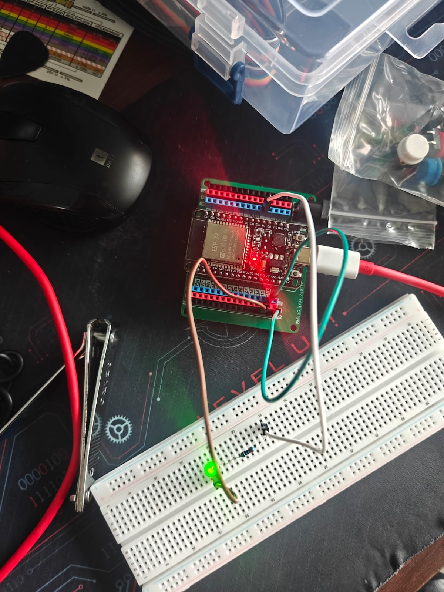
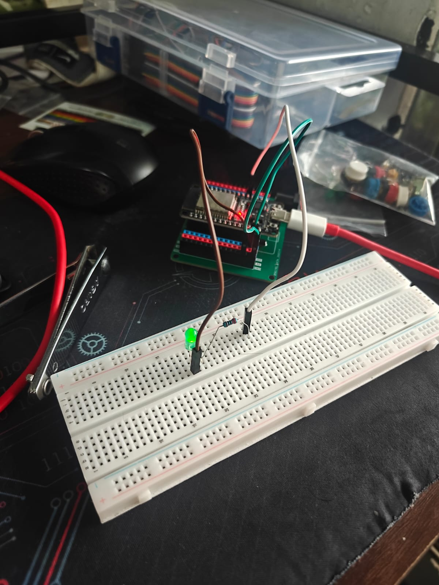
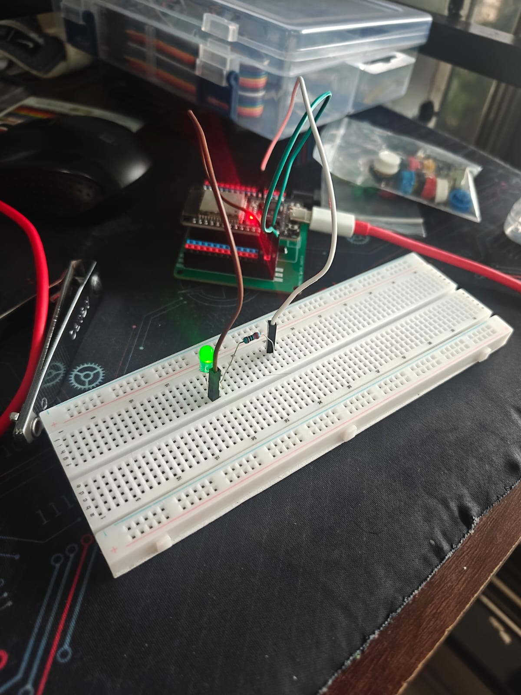
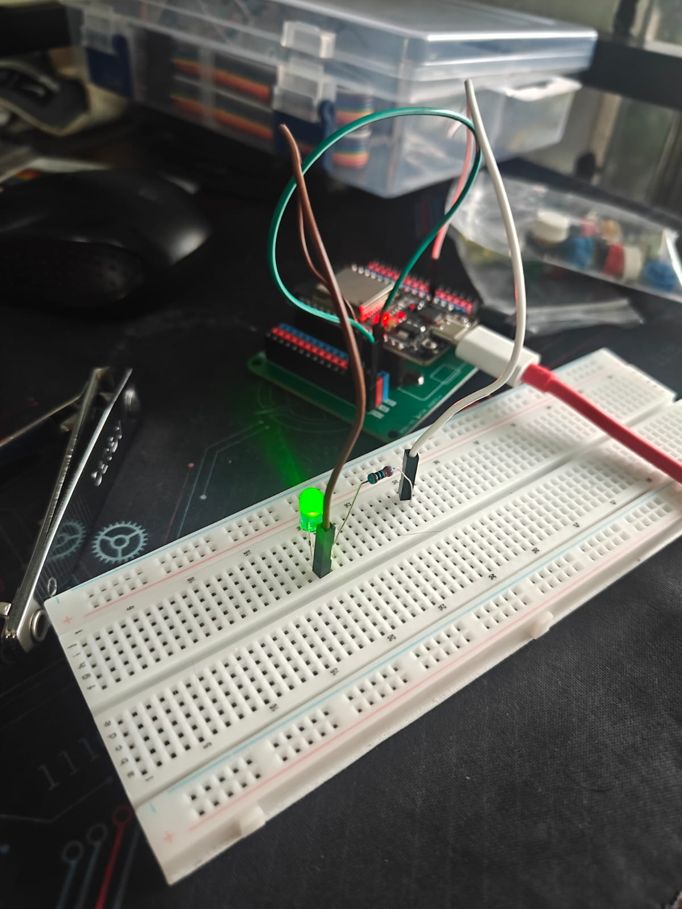

# ESP32 PWM LED Dimmer - Version 1

## Overview

This project introduces **Pulse Width Modulation (PWM)** on the ESP32 by controlling the brightness of an LED. Unlike a normal digital output where the LED is either **ON** or **OFF**, PWM rapidly switches the LED on and off to create the appearance of different brightness levels.

This project marks the beginning of learning **hardware PWM**, a fundamental concept used in embedded systems for controlling LEDs, motors, servos, fans, and many other peripherals.

---

## Objectives

- Learn the basics of Pulse Width Modulation (PWM)
- Understand the concept of Duty Cycle
- Configure the ESP32's LEDC (LED Controller) peripheral
- Control LED brightness using different PWM values

---

## Components Used

- ESP32 Development Board
- LED
- 220 Ω Resistor
- Breadboard
- Jumper Wires

---

## Circuit Diagram

```text
GPIO 4 ---- 220Ω Resistor ---->|---- GND
```

---

## Working Principle

The ESP32 generates a PWM signal at a high frequency (**5 kHz**). Instead of supplying a lower voltage, it rapidly switches the output between **HIGH (3.3V)** and **LOW (0V)**.

By changing the **duty cycle** (the percentage of time the signal remains HIGH), the average power delivered to the LED changes, making it appear brighter or dimmer.

### PWM Value vs Brightness

| PWM Value | Approximate Brightness |
|-----------:|:----------------------|
| 0 | OFF |
| 64 | 25% |
| 128 | 50% |
| 192 | 75% |
| 255 | 100% |

---

## Key Concepts Learned

- Pulse Width Modulation (PWM)
- Duty Cycle
- PWM Frequency
- PWM Resolution
- ESP32 LEDC Peripheral
- Hardware PWM vs Digital Output

---

## Code Highlights

- Configured PWM on GPIO 4
- Frequency set to **5000 Hz**
- Resolution set to **8-bit (0–255)**
- Controlled LED brightness using `ledcWrite()`

---

## Experiment

Try changing the PWM value in the code:

```cpp
ledcWrite(ledPin, value);
```

Test different values such as:

- 20
- 50
- 100
- 128
- 180
- 255

Observe how the LED brightness changes while the LED never visibly blinks.

---

## Learning Outcome

After completing this project, you should understand:

- How PWM differs from a normal digital output
- How duty cycle affects LED brightness
- Why PWM creates the illusion of analog output
- How the ESP32 generates hardware PWM signals using the LEDC peripheral

This project serves as the foundation for future projects involving smooth LED fading, motor speed control, servo control, and other PWM-based applications.

---

## Future Improvements

- Smooth LED fading animation
- Button-controlled brightness adjustment
- OLED brightness display
- Save brightness level using ESP32 Preferences (non-volatile storage)
- Breathing LED effect

---

## Images

## Images

### Circuit Diagram



### Images of LED at different brightness





---

## Author

**Danger Volt**

Learning Embedded Systems step by step using the ESP32, with each project introducing a new hardware or software concept while building toward more advanced embedded applications.