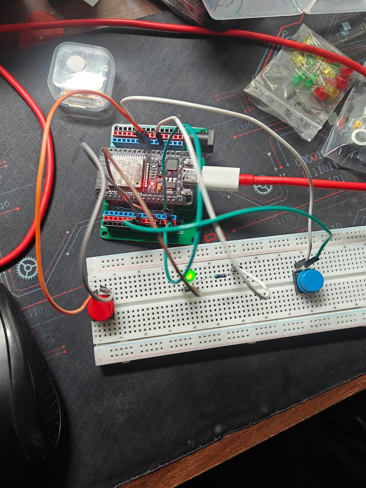

# ESP32 PWM LED Dimmer - Version 3 (Button Controlled Brightness)

## Overview

This project extends the PWM LED Dimmer by allowing the user to control the LED brightness using two push buttons. One button increases the brightness, while the other decreases it.

This version combines **digital inputs** (push buttons) with **PWM outputs**, demonstrating how user interaction can be used to control hardware in real time.

---

## Objectives

- Control LED brightness using push buttons
- Combine digital input with PWM output
- Learn edge detection for button presses
- Prevent brightness values from exceeding valid limits
- Reinforce the concept of state variables

---

## Components Used

- ESP32 Development Board
- LED
- 220 Ω Resistor
- 2 Push Buttons
- Breadboard
- Jumper Wires

---

## Circuit Diagram

### LED

```text
GPIO 4 ---- 220Ω Resistor ---->|---- GND
```

### Increase Button

```text
GPIO 5
   |
 Button
   |
 GND
```

### Decrease Button

```text
GPIO 18
   |
 Button
   |
 GND
```

> **Note:** Both buttons use the ESP32's internal pull-up resistors (`INPUT_PULLUP`).

---

## Working Principle

The LED starts at approximately **50% brightness**.

When the **Increase** button is pressed:

- The brightness value increases by 10.
- The LED becomes brighter.

When the **Decrease** button is pressed:

- The brightness value decreases by 10.
- The LED becomes dimmer.

The brightness value is always kept between **0** and **255** to ensure valid PWM output.

---

## Program Flow

```text
Start

↓

Configure PWM

↓

Configure Buttons

↓

Set Initial Brightness

↓

Read Button States

↓

Increase or Decrease Brightness

↓

Limit Brightness (0–255)

↓

Update PWM Output

↓

Repeat Forever
```

---

## Key Concepts Learned

- Pulse Width Modulation (PWM)
- Digital Inputs
- Push Button Edge Detection
- State Variables
- Value Clamping
- Combining Inputs and Outputs

---

## Code Highlights

### Increase Brightness

```cpp
brightness += 25.5;
```

### Decrease Brightness

```cpp
brightness -= 25.5;
```

### Prevent Overflow

```cpp
if (brightness > 255)
{
    brightness = 255;
}
```

### Prevent Underflow

```cpp
if (brightness < 0)
{
    brightness = 0;
}
```

### Update PWM Output

```cpp
ledcWrite(LED_PIN, brightness);
```

---

## Experiment

Try modifying the brightness step size.

### Smaller Steps

```cpp
brightness += 5;
brightness -= 5;
```

Result:

- Smoother brightness adjustments
- More button presses required to reach maximum brightness

### Larger Steps

```cpp
brightness += 25;
brightness -= 25;
```

Result:

- Faster brightness changes
- Less precise control

---

## Learning Outcome

After completing this project, you should understand:

- How digital inputs can control PWM outputs
- How to detect button presses using edge detection
- How to maintain and update a state variable
- Why limiting variable values is important in embedded systems
- How interactive hardware control works

This project demonstrates a common embedded systems workflow where user input is processed to control an output device in real time.

---

## Future Improvements

- Display the current brightness on an OLED screen
- Add a graphical brightness bar
- Save the brightness level using non-volatile memory
- Implement automatic fade mode
- Combine manual and automatic brightness control

---

## Images

### Circuit Diagram



### Demo


## Author

**Danger Volt**

Learning Embedded Systems step by step using the ESP32, with each project introducing a new hardware or software concept while building toward more advanced embedded applications.